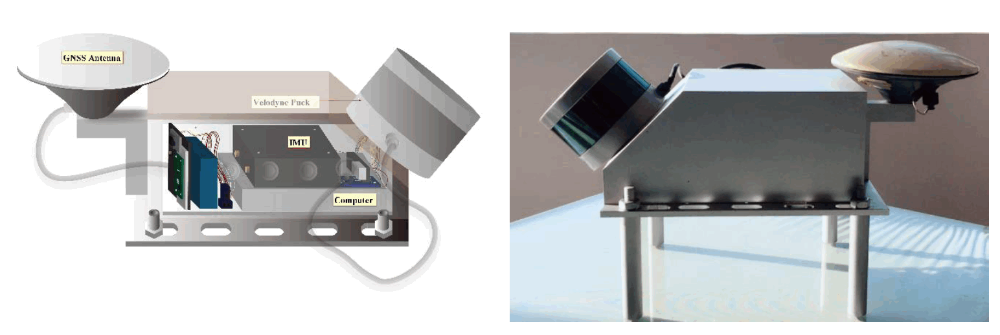
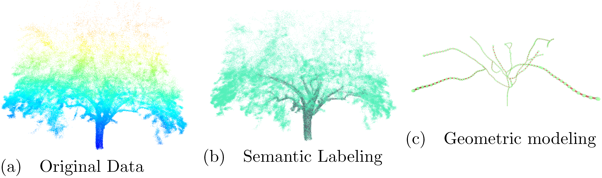

# MLS system for Railway Inspection

* The system was designed using low-cost MMES IMU, GNSS and Laser scanning devices for large-area modeling. We demonstrated its application in Railroad Inspection.

# Tree Modeling from Noisy and Low Resolution Data

* This projects considering using handhold devices for large scale forestry inventory   We developed new geometric approach to separate materials from noisy and low resolution observations.
## Geometric-based wood-leaf separation (Ours v.s. SOTA)

 
## Geometric Modelling
